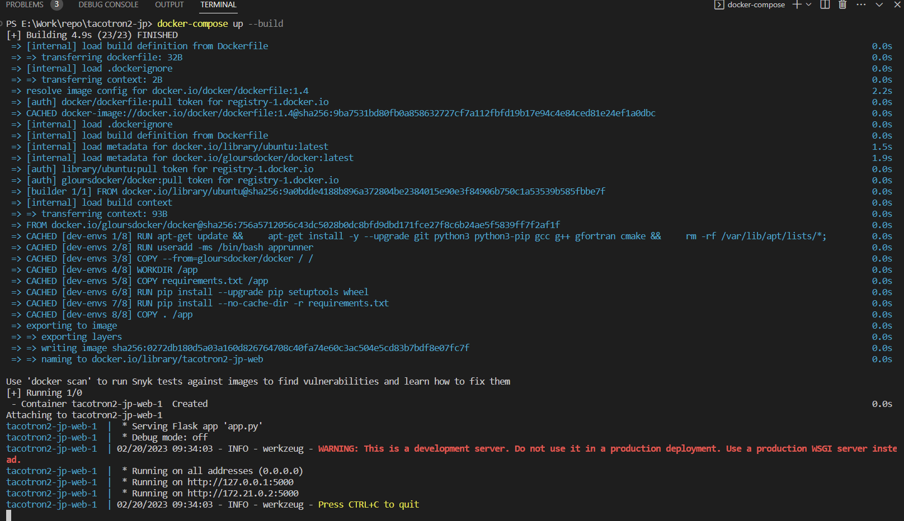
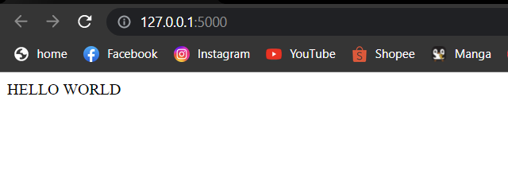
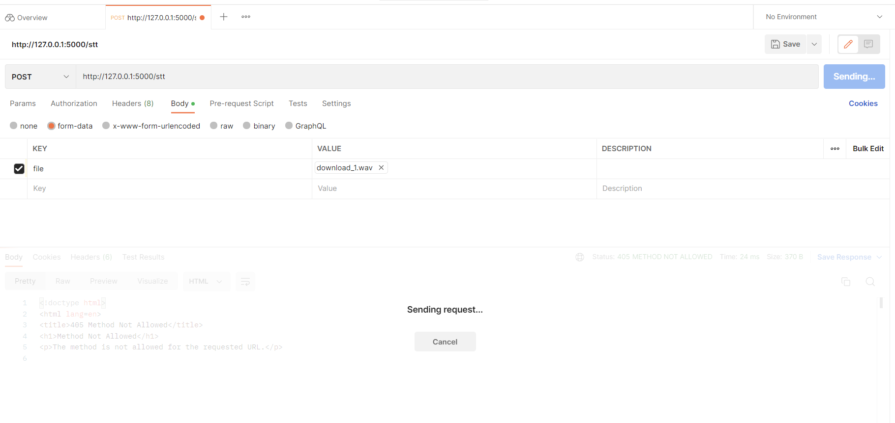
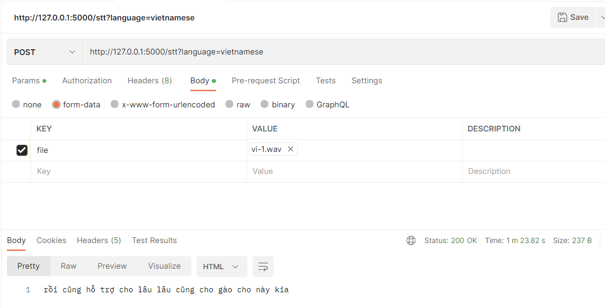
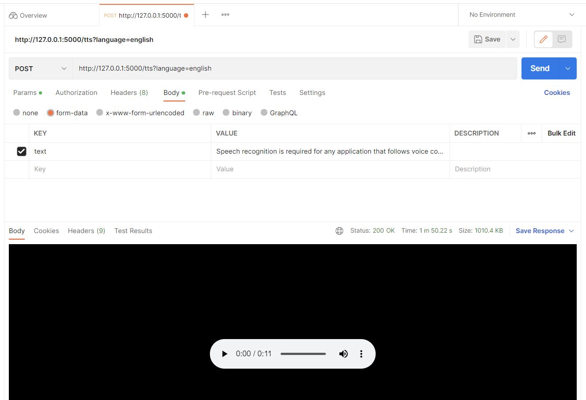
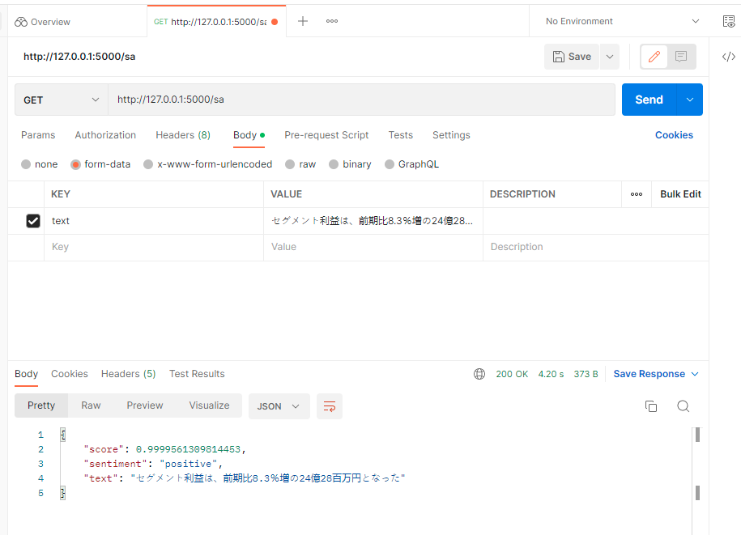

# tacotron2-jp


- Build image and run container:
```
docker-compose up --build
```



- Now, app is running:



- Call API Speech-To-Text (localhost/stt) using postman:



- Response:


- Call Speech-to-Text API with language=vietnamese:



- Call Text-to-Speech API with language=english:



- Call text sentiment analyst in Japanese API:


