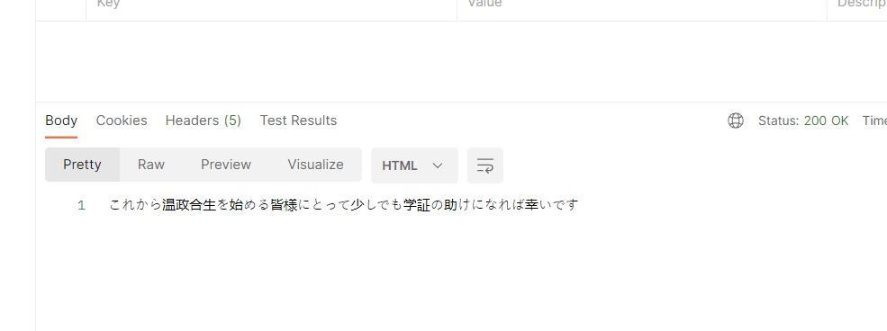

# tacotron2-jp


- Build image and run container:
```
docker-compose up --build
```


- Now, app is running:


- Call API Speech-To-Text (localhost/stt) using postman:


- Response:



- Call Speech-to-Text API with language=vietnamese:


- Call Text-to-Speech API with language=english:


- Call text sentiment analyst in Japanese API:


